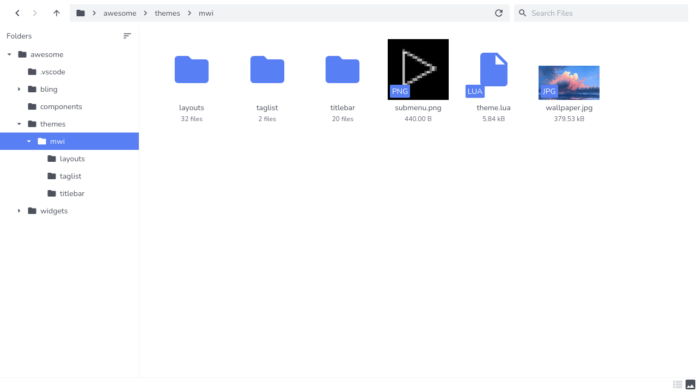

<div align="center">

# File server

**Just a random personal project that was made to view local files on the local network through a web browser.**



</div>

## Setting up

There are no thorough installation instructions since this project isn't really meant to be used for public use but feel free to use it if you really want to.

### Frontend

```sh
cd frontend
yarn install
```

### Backend

```sh
cd backend
yarn install
npx prisma migrate dev
```
